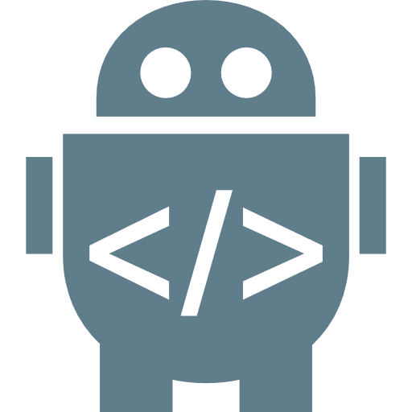

# SampleBot

<h1 align="center">
   
  
   
  Sample Bot SpringBoot 
   

SampleBot is a java sample based on SpringBoot to build a bot based on outgoing webhooks sample.

  
## Tools

<ul>
<li> SpringBoot </li>
<li> DialogFlow </li>
<li> Line API </li>
</ul>

  
## API Reference

**SampleBot** is developed under the highlights of <a href="https://dialogflow.com/docs/getting-started/basics">Dialog Flow</a>

  
## Credits

This software uses code from several open source packages.

- [AI API- Dialog Flow](https://dialogflow.com/docs/getting-started/basics)
- [Line developers](developers.line.me/)
- [Heroku](https://dashboard.heroku.com/)

